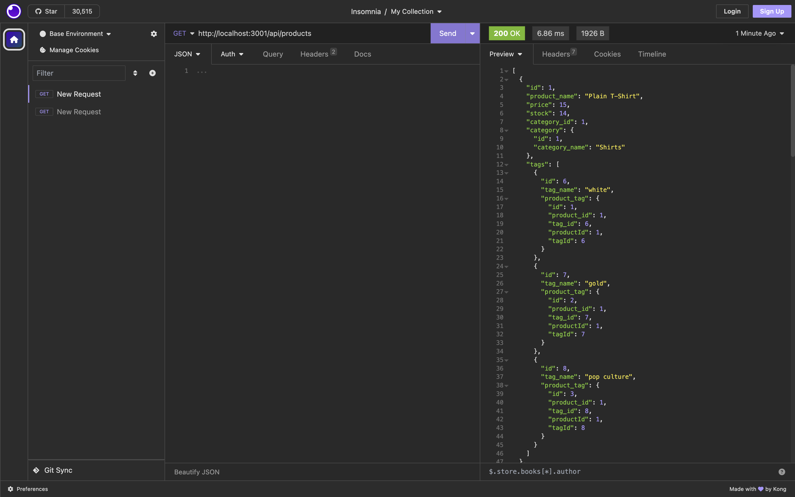
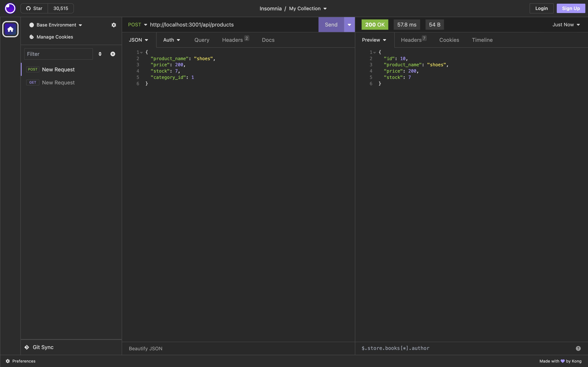
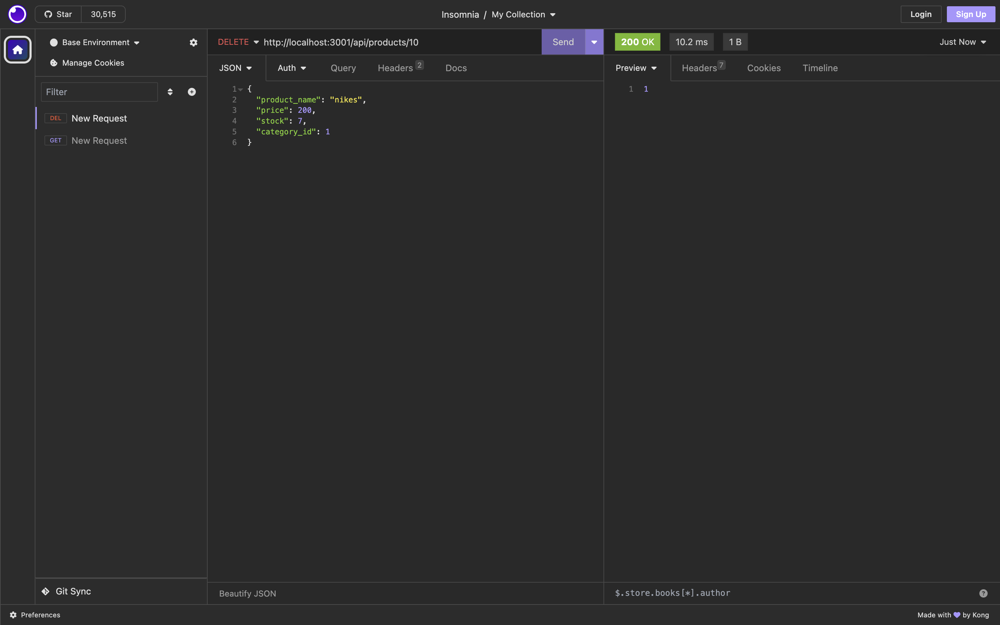

# orm-back-end

## Description

My task for this challenge was to build the back end for an e-commerce site by modifying starter code. in order to do this I had to configure a working Express.js API to use Sequelize to interact with a MySQL database. By doing this users will be able to post, update, delete and view all of the information within the database as well as see how products are related by categories and tags.

## Table of Contents
- [Description](#description)
- [Demonstration](#demonstration)
- [Screenshots](#screenshots)
- [Installation](#installation)
- [Usage](#usage)
- [Questions](#questions)

## Demonstration

https://drive.google.com/file/d/1XoQTAw3HdCBOtpMEH-nFT8QD-T5dO6W7/view

## Screenshots

## Installation

You will need to run an npm installation in order to use the express, dotenv, sequelize, and mysql2 dependencies. After that use the schema.sql file to create tour database, finally you can seed your database using npm run seed and start your server with npm run start.

## Usage

Once your environment is up and running you can use insomnia to test the get, get by id, post, put, and delete methods for the products, categories and tags.

## Questions

For any question feel free to reach out to me on my Github: [ralstonb9](https://github.com/ralstonb9)